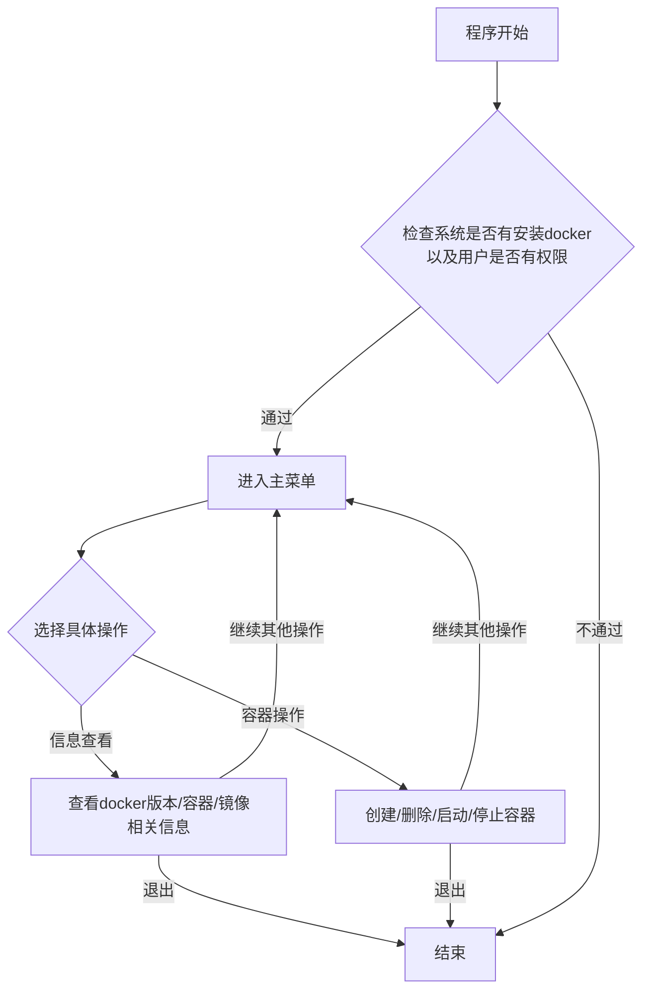

# DOCKER 一键管理脚本说明
```bash
#!/bin/sh
##################################################
#=================================================
#	System: CentOS 6+/Debian 6+/Ubuntu 16.04+
#	Description: Execute docker scripts
#       Date :2018-12-19
#	Author: Bohrium Kwong
#	Contact me: bohrium.kwong@gmail.com
#=================================================
##################################################
```
##  脚本功能描述


该脚本可以实现基本的docker容器日常管理功能，包括查看docker信息、创建/删除/启动/停止容器。其中创建容器是基于ubuntu镜像的VNC，可以根据自己的实际情况酌情修改。运行方法如下
```sudo sh docker_script.sh```
如果是docker用户组的用户，可以直接运行: ```sh docker_script.sh```
##  程序执行流程


## 关于创建VNC容器
本脚本可以接受额外传参，参数为docker images id，如:
```sh docker_script.sh image_id ```
如果没有额外传参，就会以脚本里面指定的image id进行，参看第156行:
```bash
155 if [ ! -n "$1" ] ;then
156     image_code='your_images_tag'
157 else
158     image_code=$1
159 fi

```

## Dockerfile
上面提到创建容器时所指定的**image id**就是基于这个**Dockerfile**构建成的镜像。确保**Dockerfile**和相关脚本、库包文件夹在相同目录下后，执行以下语句就可以创建镜像:

`docker build . -t your_images_tag`

如果上述执行过程中因为网络延迟而出现失败的话,再重新执行就可以

## ./build ##
这是总的创建目录目录,包括[Dockerfile](./build/Dockerfile)、[startup.sh](./build/startup.sh)还有[requirements.txt](./build/requirements.txt)和[sources.list](./build/sources.list)等关键脚本都在其中。其余相关库包,我将其打包放在[百度网盘](https://pan.baidu.com/s/1FbE5XM5w7QElWT1OvWleQA),提取码是jaik。


## 关于vnc.info文件
首次使用本脚本创建VNC容器时，会在工作目录下生成vnc.info文件，里面会记录容器的id、端口和启动密码，之后再创建容器时会在该文件插入记录。使用该脚本删除容器时也会删除该文件对应行的记录。如果文件已经被清空，会删除整个文件。

## 关于docker_script_en.sh
**docker_script_en.sh**和**docker_script.sh**实现的功能是一样的，前者的交互是基于英语，后者的交互是基于中文。